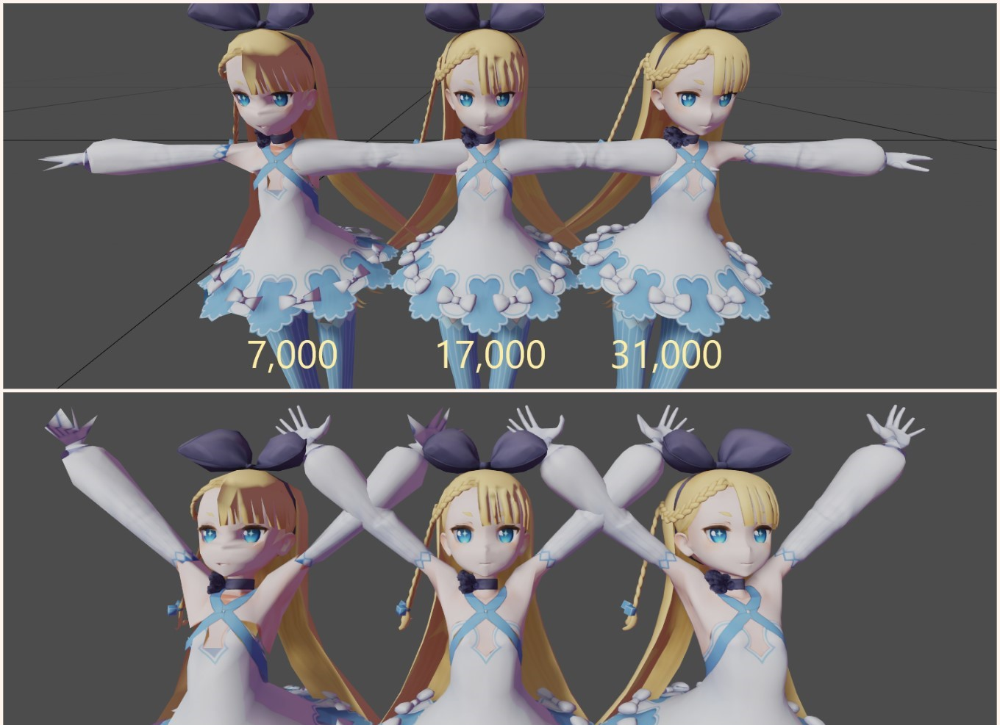

# 📦 vrmpack

vrmpack is a tool that can automatically optimize VRM files to improve loading and rendering speed.

## Purpose

This tool is experimental work indented to try out mesh-simplification algorithms that is provided by [meshoptimizer](https://github.com/zeux/meshoptimizer). *Currently this tool optimizes index buffer only, so you'll see only slightly changes regarding binary size*. Please do not use this in production :)


## Simplification

This tool provides an interface to two simplification algorithms that reduce the number of triangles in the mesh. Use only with `-si` option is usually recommended, but if you want more aggressive result, specify `-sa` option too that doesn't follow the topology of the original mesh. This means that it doesn't preserve attribute seams or borders, but it can collapse internal details that are too small to matter better because it can merge mesh features that are topologically disjoint but spatially close.

<p align="center">
<br/>
</p>

## Usage

To convert a VRM file using vrmpack, run the command-line binary like this on an input `.vrm` file (run it without arguments for a list of options):

```
vrmpack -i AliciaSolid.vrm -o AliciaSolid_optimized.vrm -si 0.5
```

This simplifies meshes to achieve the ratio R (default: 1; R should be between 0 and 1).

## Options

* `-si R`: simplify meshes to achieve the ratio R (default: 1; R should be between 0 and 1)
* `-sa`: aggressively simplify to the target ratio disregarding quality

## Building

You need [Cmake](https://cmake.org/download/) and Visual Studio with C++ environment installed. You don't need Unity nor UniVRM to build athis. There is a CMakeLists.txt file which has been tested with [Cmake](https://cmake.org/download/) on Windows. For instance in order to generate a Visual Studio 10 project, run cmake like this:


```
> mkdir build; cd build
> cmake -G "Visual Studio 10" ..
```

## License

vrmpack is available to anybody free of charge, under the terms of MIT License (see LICENSE.md).
